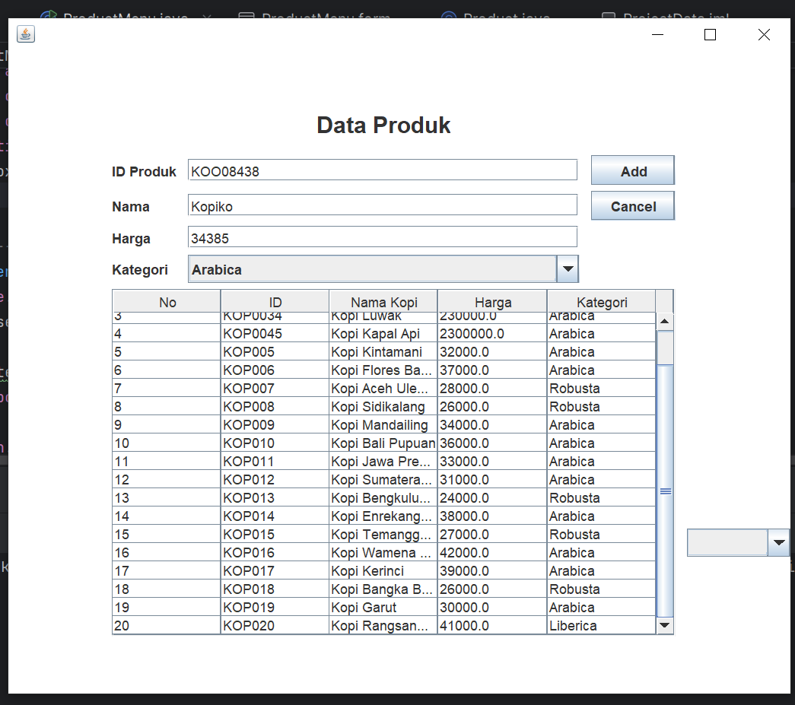
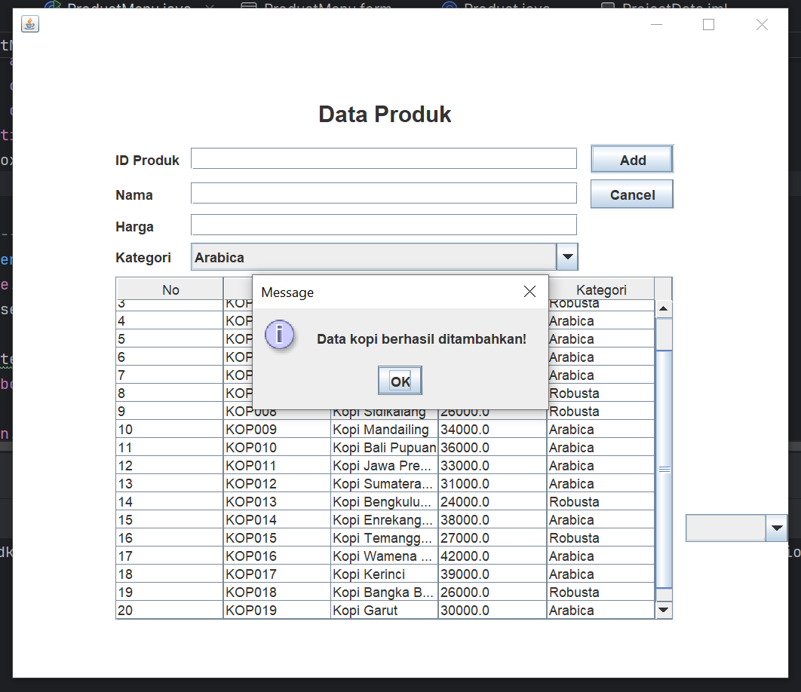
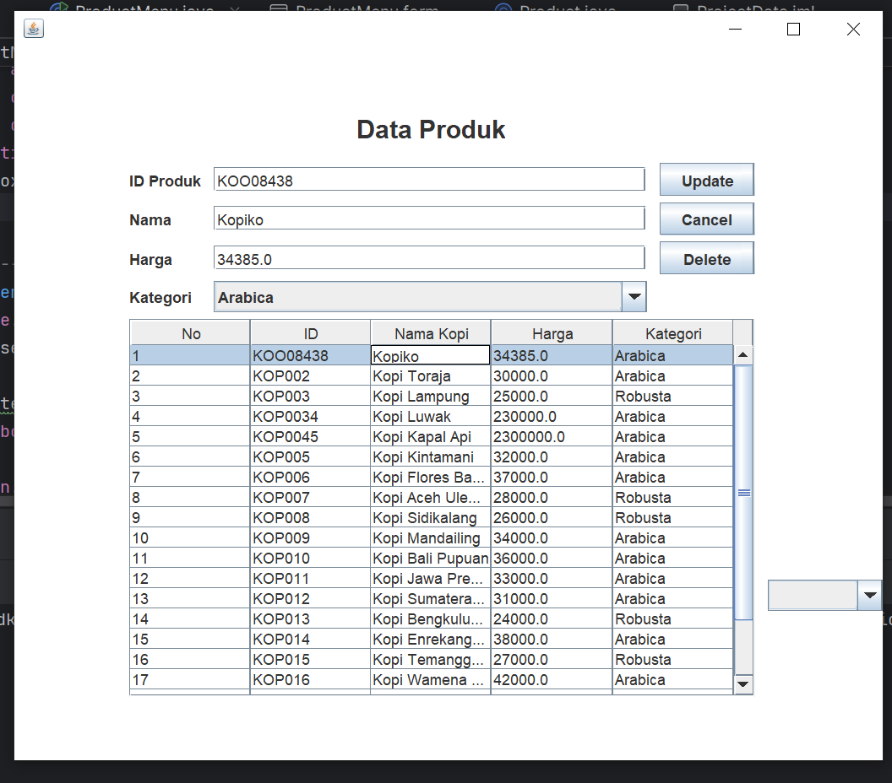
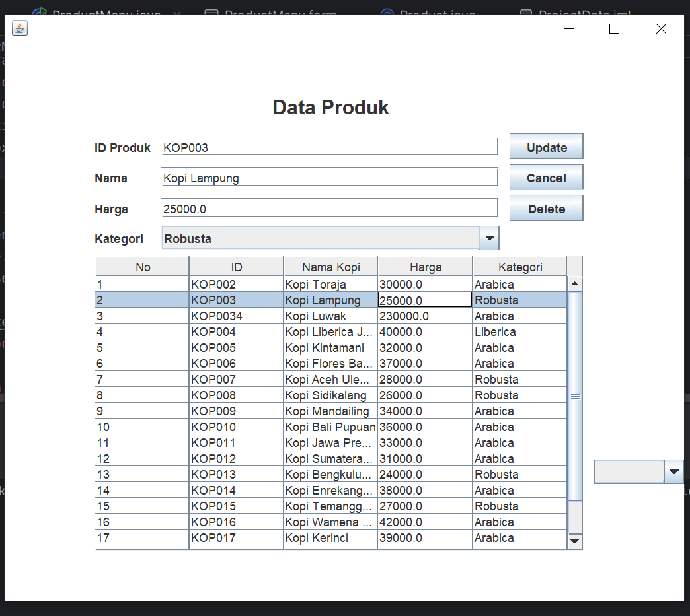
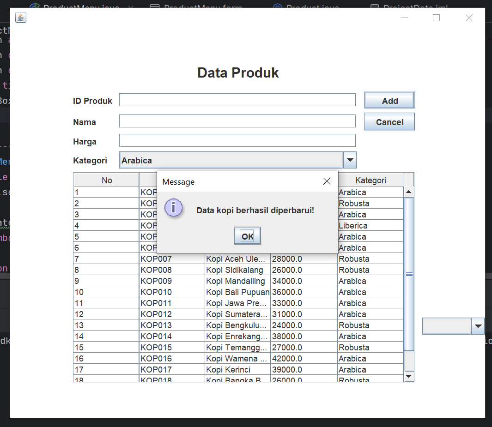
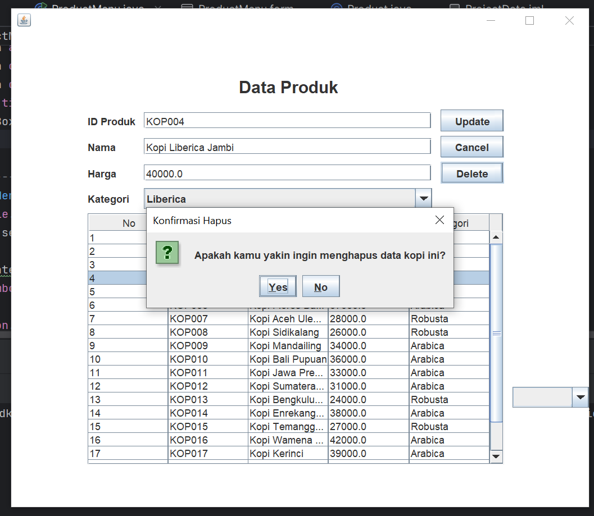
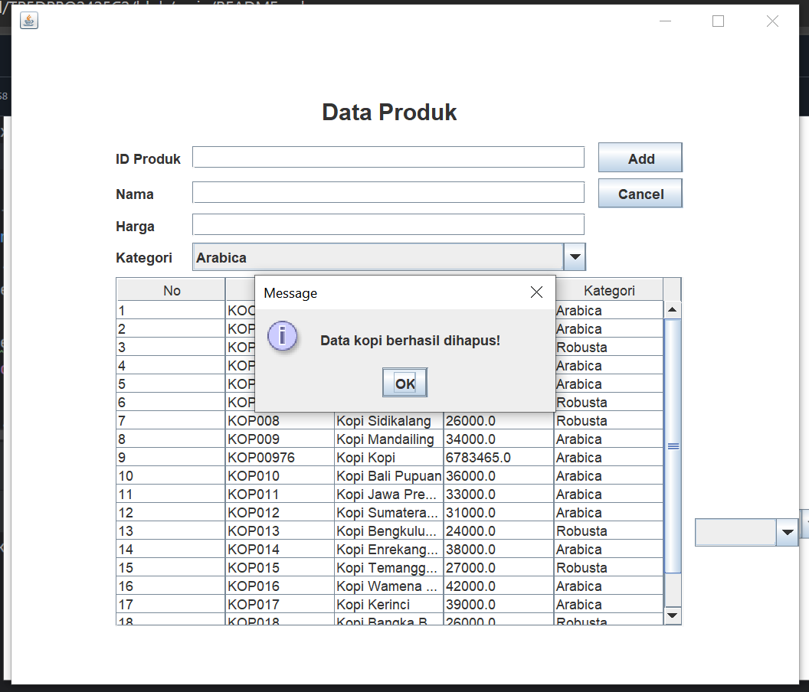
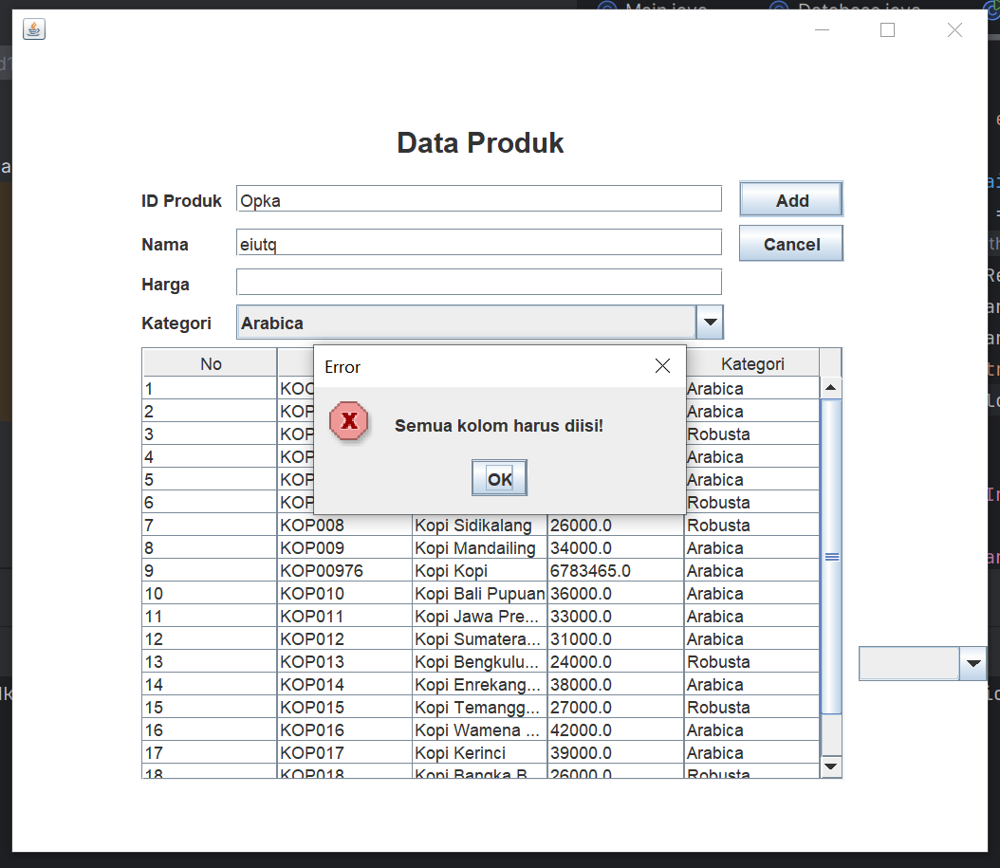
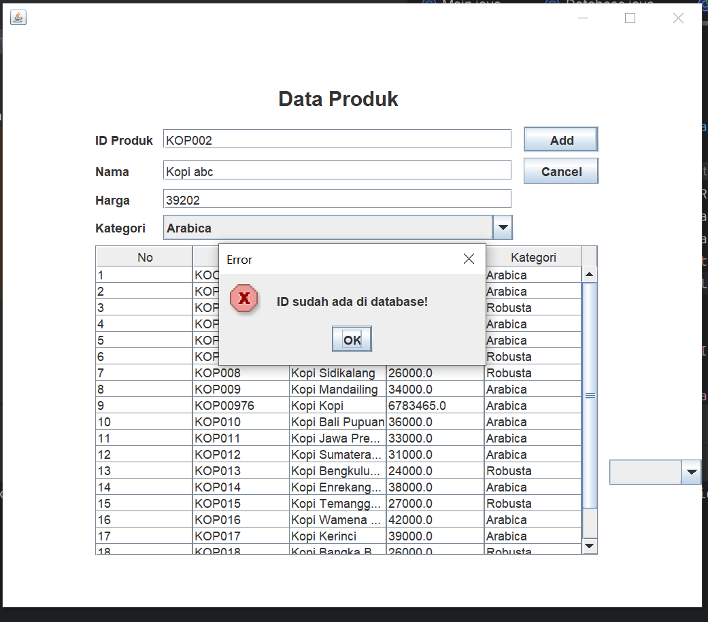

# TP5DPBO2425C2

Saya Niha April Miani dengan NIM 2402567 mengerjakan Tugas Praktikum 5 dalam mata kuliah Desain Pemogramana Berorientasi Objek untuk keberkahanNya maka saya tidak melakukan kecurangan seperti yang telah dispesifikasikan. Aamiin

## Desain Program ##
## 1. Komponen Utama GUI: ##
   - JPanel (mainPanel) → Panel utama tempat seluruh komponen GUI ditampilkan
   - JTextField (idField, namaField, hargaField) → Input teks untuk mengisi ID, nama kopi, dan harga
   - JComboBox (kategoriComboBox) → Pilihan kategori kopi (Arabica, Robusta, Liberica)
   - JTable (productTable) → Menampilkan seluruh data kopi dari tabel produk di database
   - JButton (addUpdateButton, cancelButton, deleteButton) → Tombol untuk aksi CRUD:
      - Add / Update → Menambah atau memperbarui data
      - Cancel → Membersihkan form input
      - Delete → Menghapus data yang dipilih
   - JLabel (titleLabel) → Judul besar aplikasi “Product Menu”

## 2. Desain Database ##
   - Nama database: db_product_menu
   - Tabel: Produk
   - Kolom: id (Primary kwy), nama (Nama kopi), hargan (Harga kopi), kategori (Jenis kopi: Arabica,Robusta,       Liberica)
   - Tipe data: VARCHAR(10), VARCHAR(100), DOUBLE, VARCHAR(50)

## Alur Program ##
## 1. Program dijalankan ##
- Kelas ProductMenu dijalankan melalui main()
- Ukuran jendela diatur (setSize(700,600)), ditampilkan (setVisible(true))
- Fungsi setTable() langsung dipanggil untuk menampilkan semua data dari database MySQL ke JTable

## 2. Menampilkan Data dari Database (setTable) ##
- Program membuka koneksi ke MySQL (getConnection())
- Melakukan query SELECT * FROM produk
- Hasil query ditampilkan dalam tabel (productTable)
- Jika gagal, muncul pesan "Gagal memuat data"

## 3. Menambahkan Data Baru (insertData) ##
- Pengguna mengisi id, nama, harga, dan memilih kategori
- Jika salah satu kosong → muncul pesan error
- Program memeriksa apakah id sudah ada di database
= Jika belum ada → data dimasukkan ke tabel produk lewat query:
  INSERT INTO produk VALUES (?, ?, ?, ?)
- Setelah berhasil:
  - Tabel diperbarui (setTable())
  - Form dikosongkan (clearForm())
  - Pesan “Data kopi berhasil ditambahkan!” muncul
 
## 4. Memilih Data di Tabel ##
- Saat pengguna mengklik baris di JTable:
- Data baris tersebut diambil (MouseListener)
- Nilai ditampilkan ke dalam field form (idField, namaField, hargaField, kategoriComboBox)
- Tombol “Add” berubah jadi “Update”
- Tombol “Delete” muncul

## 5. Mengubah Data (updateData) ##
- Setelah memilih data dari tabel dan mengedit field:
  - Tombol “Update” ditekan
  - Query yang dijalankan:
      UPDATE produk 
      SET nama=?, harga=?, kategori=? 
      WHERE id=?
- Setelah sukses:
  - Data di tabel diperbarui
  - Form dikosongkan dan mode kembali ke “Add”
  - Pesan “Data kopi berhasil diperbarui!” muncul

## 6. Menghapus Data (deleteData) ##
- Pengguna klik data dari tabel → tekan tombol “Delete”
- Muncul dialog konfirmasi (YES/NO)
- Jika “YES”, program menjalankan:
    DELETE FROM produk WHERE id=?
- Setelah berhasil:
  - Data hilang dari database
  - Tabel diperbarui
  - Pesan “Data kopi berhasil dihapus!” muncul

## 7. Membersihkan Form (clearForm) ##
- Mengosongkan seluruh input field
- Mengatur kembali mode tombol ke “Add”
- Menyembunyikan tombol “Delete”
- Mengembalikan selectedIndex ke -1

## Dokumentasi ##

## 1. ADD ##

## 2. UPDATE ##

## 3. DELETE ##

## ERROR JIKA KOLOM INPUT KOSONG ##

## ERROR KOLOM ID SUDAH ADA ##

